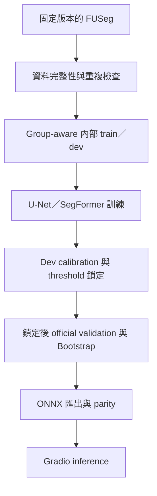

# WoundScope

[](https://colab.research.google.com/github/kuotunyu/WoundScope/blob/main/notebooks/WoundScope_FUSeg_FullRun_Colab.ipynb)
[](#快速開始)
[](https://github.com/kuotunyu/WoundScope/actions/workflows/ci.yml)
[](https://github.com/kuotunyu/WoundScope/releases/tag/v0.2.0)

**從資料治理、可恢復訓練到 ONNX deployment 的可重現足部潰瘍 segmentation pipeline。**

以固定版本 FUSeg 驗證 U-Net 與 SegFormer；最佳 U-Net 在鎖定後 official validation 達到 **Dice 0.8508 ± 0.0035**（`n=3 seeds`）。這是研究用像素分割結果，不是 official-test 或 clinical performance。

## 專案亮點

- **可信資料治理：**固定 FUSeg revision、integrity audit，排除 7 張 train exact copies，完整保留 validation 200 張。
- **可重現實驗：**Group-aware train／dev、AMP、atomic resume、三個固定 seeds 與 dev-only calibration。
- **部署級交付：**locked official validation、Bootstrap、ONNX parity、CPU Gradio 與 privacy-safe handoff。

## 已驗證成果


<!-- RESULTS_TABLE_START -->

| Model | Loss | Seeds | Dice mean±SD (95% CI) | IoU | Precision | Recall | Specificity |
|---|---|---|---:|---:|---:|---:|---:|
| unet_efficientnet_b0 | bce_dice | 42/43/44 | 0.8508±0.0035 (0.8218–0.8768) | 0.7772±0.0039 | 0.8581±0.0056 | 0.9039±0.0032 | 0.9989±0.0000 |
| segformer_b0 | bce_dice | 42/43/44 | 0.8270±0.0040 (0.7973–0.8550) | 0.7437±0.0053 | 0.8326±0.0038 | 0.8832±0.0045 | 0.9988±0.0000 |

<!-- RESULTS_TABLE_END -->

結果來自 training commit `c7ec6060f1bd0a813a890b95b50c2855d3c2640c` 的 schema-valid safe bundle；指標是三個 training seeds 的 image-level mean 及 image-cluster bootstrap 2,000 次 95% CI。

在這個 locked official-validation split 上，U-Net observed Dice 較高，但未做 paired significance test；結果不是 official-test 或 clinical performance。

## 流程全貌



## 快速開始

Python 支援 3.11–3.12。以 [Public Colab](https://colab.research.google.com/github/kuotunyu/WoundScope/blob/main/notebooks/WoundScope_FUSeg_FullRun_Colab.ipynb) 為主要入口；按下 `Run all` 會執行完整 GPU pipeline，所有 artifacts 留在使用者 private Drive。

本機重現：

```powershell
uv venv --python 3.12
uv sync --all-extras --frozen
$env:WOUNDSCOPE_DATA_DIR = "data"
.\.venv\Scripts\python.exe scripts\download_data.py
```

<details>
<summary>本機 Gradio</summary>

```powershell
$env:WOUNDSCOPE_MODEL_PATH = "artifacts\runs\RUN\model.onnx"
$env:WOUNDSCOPE_CALIBRATION_PATH = "artifacts\runs\RUN\calibration.json"
.\.venv\Scripts\python.exe app\app.py
```

</details>

Hugging Face Space 目前為 `PERMISSION_PENDING`；僅維持 code-only candidate，安全部署與授權 gate 請見 [docs/huggingface-space-deployment.md](docs/huggingface-space-deployment.md)。

## 工程可信度

- **資料：**固定 revision 的 pairing、decode、尺寸、mask 值、SHA-256 與 pHash integrity audit；cross-split exact copies 採 `exclude_train`。
- **訓練：**group-aware internal split、conservative augmentation、可恢復的 atomic checkpoints 與固定 seeds。
- **評估與部署：**僅以 internal dev 選擇 calibration／threshold，再做 locked official validation、Bootstrap 與 ONNX parity；CPU Gradio 顯示模型輸出。
- **品質 gates：**synthetic-fixture tests、format／lint、package build 與 tracked privacy audit 持續保護公開 repository。

## 限制與安全界線

- 資料沒有 patient ID，因此不宣稱 patient-wise split，且無法完全排除來源相關性。
- official test 沒有公開 masks；沒有 official-test metrics，也尚無 external validation。
- confidence 是模型分割穩定性與 calibration 指標，不是 clinical confidence。
- 本工具僅供研究與工程展示，不提供診斷、嚴重度、預後或治療建議；所有結果都需要合格專業人員人工複核。

## 文件與 Release

- [v0.2.0 文件](docs/releases/v0.2.0.md)／[v0.2.0 release](https://github.com/kuotunyu/WoundScope/releases/tag/v0.2.0)：軟體 release、M7 closeout 與 permission boundary。
- [v0.1.0 result release](https://github.com/kuotunyu/WoundScope/releases/tag/v0.1.0)：privacy-safe aggregate results，不含 data、weights、ONNX binaries 或 private images。
- [PROJECT_PLAN.md](PROJECT_PLAN.md)／[DATA_CARD.md](DATA_CARD.md)／[MODEL_CARD.md](MODEL_CARD.md)：研究協議、資料與模型邊界。
- [scripts/download_artifacts.md](scripts/download_artifacts.md)／[CITATION.cff](CITATION.cff)／[Apache-2.0 LICENSE](LICENSE)：artifact 取回、引用與程式碼授權。
