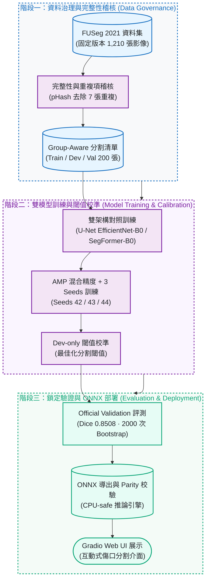

# WoundScope

[](https://colab.research.google.com/github/kuotunyu/WoundScope/blob/main/notebooks/WoundScope_FUSeg_FullRun_Colab.ipynb)
[](#快速開始)
[](https://github.com/kuotunyu/WoundScope/actions/workflows/ci.yml)
[](https://github.com/kuotunyu/WoundScope/releases/tag/v0.2.0)
[](LICENSE)

本專案提供從資料治理、斷點續跑訓練到 ONNX 邊緣部署之可重現糖尿病足部潰瘍實例語意分割 (Foot Ulcer Segmentation) 系統：以固定版本 FUSeg 基準驗證 U-Net 與 SegFormer 雙架構，最佳 U-Net (EfficientNet-B0) 在官方鎖定驗證集上達到 Dice **0.8508 ± 0.0035** (3 個獨立種子，2,000 次 Bootstrap 驗證)。

> **研究聲明**：本專案為研究用像素分割成果與工程管線展示，非臨床診斷建議；所有分析結果均需合格醫療專業人員複核。

---

## 系統設計與關鍵特性

1. **嚴謹資料治理與完整性稽核**：
   鎖定 FUSeg 2021 固定修訂版，透過 pHash 演算法嚴格排除跨切分 7 筆精確重複影像 (Train Exact Copies)，完整保留 200 張官方驗證集。
2. **可重現實驗與雙架構對照**：
   採 Group-aware 內部切分、AMP 自動混合精度、原子化斷點續跑 Checkpoints、3 個固定隨機種子 (Seeds 42/43/44) 與 Dev-only 閾值校準。
3. **生產級邊緣部署與 Parity 校驗**：
   完成 PyTorch 轉 ONNX 算子對齊校驗 (Parity Check)、2,000 次 Bootstrap 統計信賴區間檢驗、CPU-safe Gradio Web UI 展示與隱私安全交接。

---

## 系統架構與 Pipeline



---

## 成果展示與模型評測


<!-- RESULTS_TABLE_START -->

| Model | Loss | Seeds | Dice mean±SD (95% CI) | IoU | Precision | Recall | Specificity |
|---|---|---|---:|---:|---:|---:|---:|
| unet_efficientnet_b0 | bce_dice | 42/43/44 | 0.8508±0.0035 (0.8218–0.8768) | 0.7772±0.0039 | 0.8581±0.0056 | 0.9039±0.0032 | 0.9989±0.0000 |
| segformer_b0 | bce_dice | 42/43/44 | 0.8270±0.0040 (0.7973–0.8550) | 0.7437±0.0053 | 0.8326±0.0038 | 0.8832±0.0045 | 0.9988±0.0000 |

<!-- RESULTS_TABLE_END -->

- **數據來源與驗證**：評測數據來自 training commit `c7ec6060f1bd0a813a890b95b50c2855d3c2640c` 之 schema-valid 封裝；指標為 3 個訓練種子之影像平均值，並經 2,000 次 Image-Cluster Bootstrap 估計 95% 信賴區間。
- **架構表現**：在鎖定官方驗證集上，U-Net (EfficientNet-B0) 呈現較高之 Dice 數值表現。

---

## 快速開始

Python 支援 3.11–3.12。以 [Public Colab](https://colab.research.google.com/github/kuotunyu/WoundScope/blob/main/notebooks/WoundScope_FUSeg_FullRun_Colab.ipynb) 為主要線上入口（按下 `Run all` 即可執行完整 GPU 訓練管線，產物保留於使用者個人 Google Drive）。

### 本機環境重現與資料下載

```powershell
# 1. 建立虛擬環境並安裝依賴
uv venv --python 3.12
uv sync --all-extras --frozen

# 2. 下載 FUSeg 數據集
$env:WOUNDSCOPE_DATA_DIR = "data"
.\.venv\Scripts\python.exe scripts\download_data.py
```

<details>
<summary><strong>啟動本機 Gradio Web UI</strong></summary>

```powershell
$env:WOUNDSCOPE_MODEL_PATH = "artifacts\runs\RUN\model.onnx"
$env:WOUNDSCOPE_CALIBRATION_PATH = "artifacts\runs\RUN\calibration.json"
.\.venv\Scripts\python.exe app\app.py
```

</details>

Hugging Face Space 目前為 `PERMISSION_PENDING`；維持 code-only 候選發布，部署與授權說明請見 [docs/huggingface-space-deployment.md](docs/huggingface-space-deployment.md)。

---

## 工程可信度與安全性

1. **資料層面**：固定 Revision 影像配對、解碼、尺寸規格、Mask 數值檢驗、SHA-256 與 pHash 完整性稽核，跨切分重複項一律排除。
2. **訓練層面**：Group-aware 內部資料切分、保守型幾何增強、可恢復式原子 Checkpoint 與固定隨機種子。
3. **評估與部署**：僅以內部 Dev 集選擇最佳 Calibration 閾值，嚴格隔離 Official Validation 進行盲測；產出 CPU-safe ONNX 模型與 Gradio 介面。
4. **品質門禁 (Quality Gates)**：Synthetic-fixture 測試、Ruff Format/Lint、Package Build 與資安隱私稽核持續防護。

---

## 限制與安全界線

- **患者 ID 限制**：資料集未包含 Patient ID，因此不宣稱 Patient-wise 絕對隔離，無法完全排除同病患跨視角之來源相關性。
- **無官方測試集標註**：Official Test 尚未公開 Ground-truth Masks，故本專案指標均基於 200 張 Official Validation，尚未涵蓋外部臨床機構資料集。
- **非臨床診斷建議**：模型信心度代表分割演算法之數值穩定性與校準度，非臨床信心度；本專案僅供學術研究與工程探索。

---

## 文件與 Release

- [v0.2.0 Release](https://github.com/kuotunyu/WoundScope/releases/tag/v0.2.0)：軟體發布、Repository 強化與授權邊界。
- [v0.1.0 Result Release](https://github.com/kuotunyu/WoundScope/releases/tag/v0.1.0)：正式實驗的 privacy-safe aggregate results 與 provenance。
- [DATA_CARD.md](DATA_CARD.md) / [MODEL_CARD.md](MODEL_CARD.md)：資料治理、實驗協議、模型指標與使用邊界。
- [CITATION.cff](CITATION.cff) / [Apache-2.0 LICENSE](LICENSE)：學術引用格式與程式碼授權。
