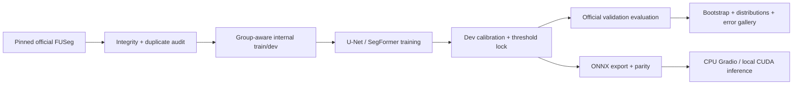

# WoundScope

[](https://colab.research.google.com/github/kuotunyu/WoundScope/blob/main/notebooks/WoundScope_FUSeg_FullRun_Colab.ipynb)
[](#gradio-demo)
[](https://github.com/kuotunyu/WoundScope/actions/workflows/ci.yml)

WoundScope 是一套可重現的足部潰瘍區域 segmentation 研究與部署 pipeline。它從官方 FUSeg 像素標註資料開始，涵蓋 integrity validation、U-Net／SegFormer 訓練、calibration、bootstrap evaluation、ONNX export 與 Gradio demo。輸出只描述模型預測的像素區域，不提供疾病診斷、嚴重度或治療建議。

> 專案狀態：M0–M6 已完成，GitHub hosted CI 已通過；Colab full training、三-seed locked official-validation evaluation、ONNX parity／benchmark 與 privacy-safe handoff 均已完成。模型權重仍只保存在 private Drive，未包含於 repository。請以 [PROGRESS.md](PROGRESS.md) 為準。

## 問題定義與資料

模型輸入為足部傷口 RGB 影像，輸出單通道 wound logits。資料固定取自官方 repository revision `42a272dfe0679f20675e826385925cb7562934b6`：

| Official split | Images | Public masks | 用途 |
|---|---:|---:|---|
| train | 810 | 810 | 依 duplicate group 與 foreground ratio 建立 internal train/dev |
| validation | 200 | 200 | checkpoint、threshold 與 temperature 凍結後的最終評估 |
| test | 200 | 0 | blind prediction／challenge-format smoke；不可宣稱 metrics |

官方資料檢查另外發現 7 組 train–validation 完全相同影像，及多組 pHash near-duplicate 警告。正式跨 split 政策已鎖定為 `exclude_train`：只從 training pool 排除 7 張 train copy，完整保留 official validation 200 張；official validation 不參與 loss、checkpoint、threshold 或 temperature 選擇。資料沒有 patient ID，因此本專案不宣稱 patient-wise split，亦無法排除同一來源或同一個案相關性。

- [官方 FUSeg 目錄](https://github.com/uwm-bigdata/wound-segmentation/tree/42a272dfe0679f20675e826385925cb7562934b6/data/Foot%20Ulcer%20Segmentation%20Challenge)
- [Challenge design PDF](https://github.com/uwm-bigdata/wound-segmentation/blob/42a272dfe0679f20675e826385925cb7562934b6/data/Foot%20Ulcer%20Segmentation%20Challenge/FootUlcerSegmentationChallenge2021.pdf)
- [原始論文](https://doi.org/10.1038/s41598-020-78799-w)

Challenge PDF 僅寫「CC BY NC」，沒有版本、legal-code 連結或 repository LICENSE。授權資訊因此視為不完整：原始影像、labels、image-level manifest、gallery、checkpoint 與 ONNX 均不 commit／重傳。Apache-2.0 只涵蓋 WoundScope 程式碼；模型權重公開前仍須人工確認資料條款。詳見 [DATA_CARD.md](DATA_CARD.md)。

## 方法

- Baseline：ImageNet EfficientNet-B0 encoder 的 U-Net。
- Advanced：pretrained SegFormer-B0。
- Loss：`0.5 BCEWithLogits + 0.5 Dice`，以及 `0.5 Focal + 0.5 Tversky`。
- Conservative augmentation：512 resize/pad、保留至少 90% foreground 的輕度 crop、horizontal flip、±10° affine、輕度 brightness/contrast/color；不使用 vertical flip、elastic distortion、強烈 crop 或 coarse dropout。
- 訓練：AMP（CUDA）、gradient accumulation、early stopping、每 epoch atomic checkpoint／trainer state／CSV／TensorBoard／partial results。
- 評估：image-level 與 global Dice、IoU、precision、recall、specificity；mean、median、SD、IQR；image-cluster bootstrap 2,000 次 95% CI。
- Calibration：internal dev temperature scaling 與 threshold sweep；original + horizontal-flip 2-view TTA 估計 entropy/agreement confidence。
- 低信心：低於 dev 第 10 百分位、空 prediction 或缺 calibration metadata 時顯示「需人工複核」。這是模型分割信心，不是臨床信心。



## 快速開始

Python 支援 3.11–3.12。Windows 的含中文字徑若遇到舊版 Anaconda codepage 問題，建議以 UTF-8-capable Python 3.11/3.12 建立環境。

```powershell
# Windows PowerShell
uv venv --python 3.12
uv sync --all-extras --frozen
$env:WOUNDSCOPE_DATA_DIR = "data"
.\.venv\Scripts\python.exe scripts\download_data.py
```

```bash
# WSL2 / Linux
uv venv --python 3.12
uv sync --all-extras --frozen
export WOUNDSCOPE_DATA_DIR=data
.venv/bin/python scripts/download_data.py
```

下載器採 pinned sparse-checkout，驗證 pairing、decode、尺寸、binary/anti-aliased masks、SHA-256、pHash 與 cross-split duplicates，並在 gitignored `data/manifests/` 產生 `data_manifest.csv` 與 `data_summary.json`。目前官方 revision 因已知 exact duplicates，預設會以 exit code 2 告警；manifest 仍會寫出供審閱。

所有 training 都必須明確使用已鎖定的 `exclude_train` 政策：

```bash
.venv/bin/python scripts/train.py \
  --model-config configs/models/unet_efficientnet_b0.yaml \
  --mode-config configs/modes/quick.yaml \
  --cross-split-policy exclude_train \
  --device auto
```

完整順序與 seeds／loss protocol 請依 [PROJECT_PLAN.md](PROJECT_PLAN.md)，不要用 official validation 調參。

## 評估、ONNX 與本機推論

```bash
# 僅在 internal dev fit calibration
.venv/bin/python scripts/evaluate.py \
  --model-config configs/models/unet_efficientnet_b0.yaml \
  --mode-config configs/modes/full.yaml \
  --checkpoint artifacts/runs/RUN/best_model.safetensors \
  --calibration artifacts/runs/RUN/calibration.json \
  --selector dev --fit-calibration \
  --output artifacts/runs/RUN/dev_evaluation --device auto

# 使用凍結 metadata 評估 official validation
.venv/bin/python scripts/evaluate.py \
  --model-config configs/models/unet_efficientnet_b0.yaml \
  --mode-config configs/modes/full.yaml \
  --checkpoint artifacts/runs/RUN/best_model.safetensors \
  --calibration artifacts/runs/RUN/calibration.json \
  --selector official_validation \
  --output artifacts/runs/RUN/official_validation --device auto

.venv/bin/python scripts/export_onnx.py \
  --model-config configs/models/unet_efficientnet_b0.yaml \
  --checkpoint artifacts/runs/RUN/best_model.safetensors \
  --output artifacts/runs/RUN/model.onnx

.venv/bin/python scripts/predict.py \
  --model artifacts/runs/RUN/model.onnx \
  --calibration artifacts/runs/RUN/calibration.json \
  --input sample.jpg --output artifacts/predictions --device cpu
```

`benchmark.py` 會輸出 mean／median／p95 latency JSON。`inspect_augmentations.py` 產生人工檢查 grid；`generate_error_gallery.py` 依固定規則選出最佳、最差、小面積、低光與背景干擾案例。含原圖的輸出皆位於 gitignored 目錄。

## Colab

[notebooks/WoundScope_FUSeg_FullRun_Colab.ipynb](notebooks/WoundScope_FUSeg_FullRun_Colab.ipynb) 是 thin wrapper：掛載使用者自己的 Drive 後，優先驗證 `MyDrive/WoundScope/WoundScope_colab_source.zip`；若沒有 private source ZIP，則自動 checkout Public GitHub 的固定 `v0.1.0` tag。兩條路徑都會解析並記錄 40-character source commit、強制 CUDA，然後只呼叫一次 `scripts/run_colab_pipeline.py`。固定 stage 依序完成 data integrity、quick GPU gate、full comparison、locked loss selection、multi-seed final、official validation、ONNX/parity/benchmark 與 safe handoff；runtime 中斷後再次 Run all 會重建暫存資料、驗證 stage/output hashes並從相容 trainer state resume，不需人工切換 quick／comparison／final 或手選 loss。

直接點上方 Colab badge 並 Run all 即可使用 Public source；這會啟動完整 GPU experiment pipeline，不是短時間 demo。需要 immutable private source／既有 Drive resume 時，可先以 `scripts/build_colab_bundle.py --verify` 從乾淨 committed snapshot 產生 `artifacts/handoff/WoundScope_colab_source.zip`，再上傳為 `MyDrive/WoundScope/WoundScope_colab_source.zip`。所有 checkpoint、ONNX、TensorBoard、sample prediction 與 gallery 留在 `MyDrive/WoundScope/WoundScopeArtifacts/<source-commit-prefix>/`；只下載其中的 `handoff/woundscope_colab_results_<source-commit-prefix>.zip`。取回與 checksum/schema/privacy 驗證方式見 [scripts/download_artifacts.md](scripts/download_artifacts.md)。

## Gradio demo

> Hugging Face Space 狀態：`PERMISSION_PENDING`。目前僅有 code-only candidate；不會建立 live Space、model repository 或上傳權重／ONNX。安全部署與授權 gate 請見 [docs/huggingface-space-deployment.md](docs/huggingface-space-deployment.md)。

```bash
$env:WOUNDSCOPE_MODEL_PATH = "artifacts\runs\RUN\model.onnx"
$env:WOUNDSCOPE_CALIBRATION_PATH = "artifacts\runs\RUN\calibration.json"
.venv\Scripts\python.exe app\app.py
```

HF Space 採 CPU ONNX。若 repo 不含權重，可設定 `HF_MODEL_ID`、固定的 `HF_MODEL_REVISION`、`HF_MODEL_FILENAME` 與 `HF_CALIBRATION_FILENAME`；權重仍不得在授權未確認前公開。UI 顯示原圖、overlay、原始尺寸 wound-pixel ratio、模型分割信心、推論時間與人工複核警示。

可在乾淨、已提交的 repository 本機建立並驗證 code-only candidate：

```powershell
.venv\Scripts\python.exe scripts\build_huggingface_space_bundle.py
```

此指令不會連線、建立 Space 或處理模型檔案；預設輸出與 manifest／ZIP SHA-256 的審閱方式見 [docs/huggingface-space-deployment.md](docs/huggingface-space-deployment.md)。

## 結果

正式 `v0.1.0` 的 privacy-safe machine-readable results、ONNX parity diagnostics、CPU benchmark 與 aggregate charts 由 [GitHub Release](https://github.com/kuotunyu/WoundScope/releases/tag/v0.1.0) 提供；不包含 data、weights、ONNX binaries、private images 或 image-level results。


<!-- RESULTS_TABLE_START -->

| Model | Loss | Seeds | Dice mean±SD (95% CI) | IoU | Precision | Recall | Specificity |
|---|---|---|---:|---:|---:|---:|---:|
| unet_efficientnet_b0 | bce_dice | 42/43/44 | 0.8508±0.0035 (0.8218–0.8768) | 0.7772±0.0039 | 0.8581±0.0056 | 0.9039±0.0032 | 0.9989±0.0000 |
| segformer_b0 | bce_dice | 42/43/44 | 0.8270±0.0040 (0.7973–0.8550) | 0.7437±0.0053 | 0.8326±0.0038 | 0.8832±0.0045 | 0.9988±0.0000 |

<!-- RESULTS_TABLE_END -->

表中各 metric 為 training seeds 42/43/44 的 image-level mean 之 mean±sample SD；Dice 括號為統合三個 training seeds 的對齊 image-level values、使用 bootstrap RNG seed=42 做 2,000 次 image-cluster percentile bootstrap 所得的 95% CI。兩個架構都由 internal dev 選出 BCE+Dice；在這個 locked official-validation split 上，U-Net 的 observed Dice 較高，但未做 paired significance test，亦不代表 official test、外部資料或臨床效能。結果來源為 training commit `c7ec6060f1bd0a813a890b95b50c2855d3c2640c` 的 schema-valid safe bundle；quick／smoke 數字未納入。

## 測試與驗收

```bash
uv run ruff check .
uv run ruff format --check .
uv run pytest -q
```

CI 只使用 synthetic fixtures，不下載 medical images 或 pretrained weights。測試涵蓋資料損壞／配對／重複、loss finite gradients、known-confusion metrics、兩模型 forward、checkpoint resume、calibration、低信心規則、ONNX parity 與 app inference function。

## 限制與醫療免責

- 資料缺少 patient ID，來源相關性與跨影像洩漏風險無法完全排除。
- 官方 test masks 不公開，因此無 test metrics。
- 影像分布、膚色、相機、照明與臨床場域偏移尚未做外部驗證。
- Confidence 只反映模型輸出穩定性與 calibration，不代表疾病風險或照護安全。
- 本工具僅供研究與工程展示，不是醫療器材，不可單獨用於診斷、分級、預後或治療決策；所有結果需由合格專業人員人工複核。

## 90 秒 demo 腳本

1. 10 秒：說明任務是「像素層級 wound segmentation」，不是診斷。
2. 15 秒：展示 pinned FUSeg、manifest integrity 與 patient ID／duplicate 限制。
3. 15 秒：說明 EfficientNet-B0 U-Net baseline、SegFormer-B0 與 conservative augmentation。
4. 20 秒：上傳一張影像，展示 original、overlay、wound-pixel ratio 與 inference time。
5. 15 秒：指出模型分割信心與「需人工複核」條件。
6. 10 秒：展示 mean/distribution/bootstrap CI 與固定五類 error gallery，而非只看漂亮案例。
7. 5 秒：重申無診斷／嚴重度／治療建議，並說明資料與權重發布限制。

## License 與引用

WoundScope 程式碼使用 [Apache-2.0](LICENSE)。FUSeg 資料及衍生 artifacts 不受此 LICENSE 涵蓋。引用資訊見 [CITATION.cff](CITATION.cff)，研究與資料說明見 [MODEL_CARD.md](MODEL_CARD.md) 與 [DATA_CARD.md](DATA_CARD.md)。
