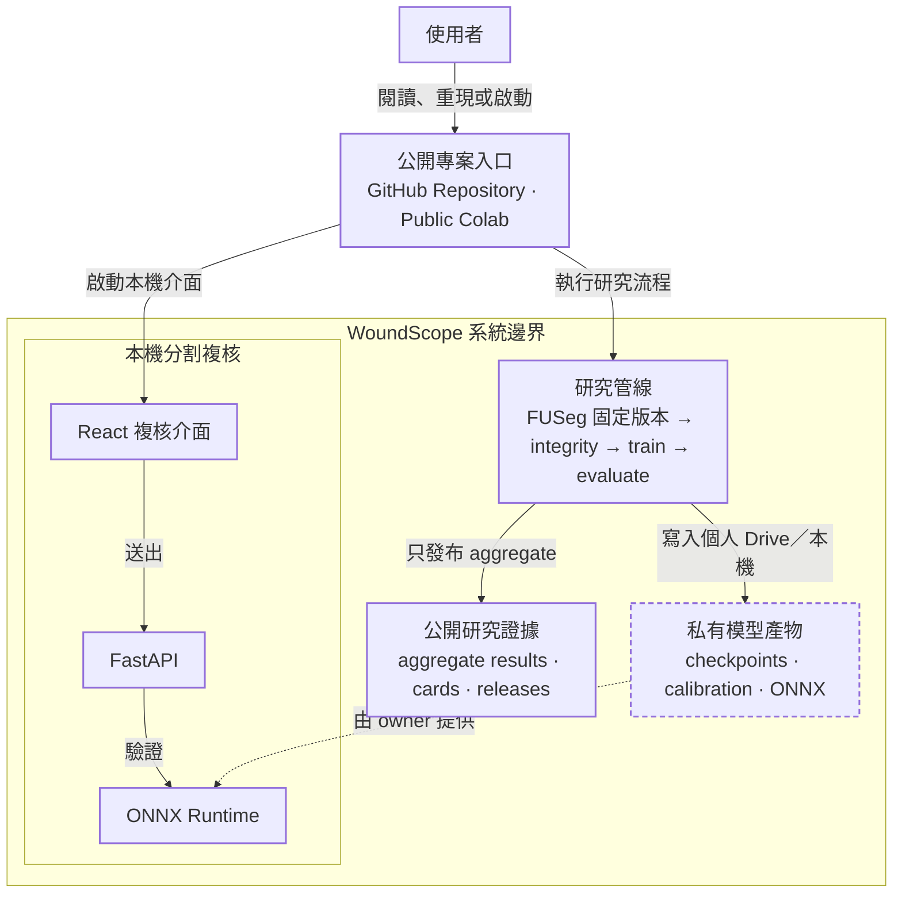
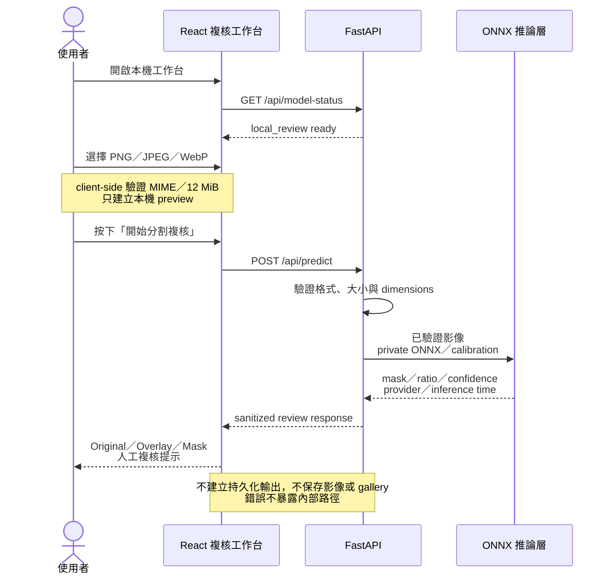

# WoundScope

[](https://colab.research.google.com/github/kuotunyu/WoundScope/blob/main/notebooks/WoundScope_FUSeg_FullRun_Colab.ipynb)
[](#快速開始)
[](https://github.com/kuotunyu/WoundScope/actions/workflows/ci.yml)
[](https://github.com/kuotunyu/WoundScope/releases/tag/v0.2.2)
[](LICENSE)

WoundScope 是以固定版本 FUSeg 建構的足部潰瘍 binary semantic segmentation **CV research flagship**：串接資料治理、可恢復 GPU 訓練、鎖定評估、ONNX parity 與 privacy-safe handoff。U-Net (EfficientNet-B0) 在 200 張 Official Validation 上的 observed Dice 為 **0.8508 ± 0.0035**（3 個 seeds；2,000 次 image-level Bootstrap 估計 95% CI）。

> **研究聲明**：本專案為研究用像素分割成果與工程管線展示，非臨床診斷建議；所有分析結果均需合格醫療專業人員複核。


全新複核工作台採 **React + TypeScript + Vite** 與 **FastAPI**，以正體中文為主，將原圖／Overlay／Mask 比較、透明度控制、mask area ratio、非臨床 confidence、review reasons、execution provider 與 artifact provenance 收斂在同一個高密度介面。公開 code-only 環境顯示**研究展示模式**；模型可用時才開啟本機分割複核，避免把私有 weights 或臆造 prediction 包進公開展示。

---

## 60 秒看懂 WoundScope

WoundScope 不是單一模型 demo，而是一套從資料治理、可重現實驗到本機人工複核的完整 Medical Computer Vision workflow。公開 repository 提供 code、文件與 aggregate evidence；可推論的 ONNX、calibration 與 checkpoints 則由使用者在自己的環境保管。

### 系統脈絡與架構（System Context）



- **單一公開入口**：使用者可從 GitHub Repository 閱讀方法與證據，或透過 Public Colab 重現鎖定實驗。
- **研究管線**：FUSeg 固定版本經資料治理、訓練與評估後，只公開 aggregate results；模型產物保留在使用者自己的環境。
- **本機複核**：React → FastAPI → ONNX Runtime 只在 owner-provided artifacts 就緒時啟用 inference。

### 可重現研究 Pipeline

資料、選模、校準與最終評估各自有明確 gate；Official Validation 只在模型選擇與 Dev-only calibration 凍結後使用。

```mermaid
%%{init: {"themeVariables": {"fontSize": "22px", "fontFamily": "Arial, sans-serif"}, "flowchart": {"nodeSpacing": 36, "rankSpacing": 44, "curve": "basis"}}}%%
flowchart LR
    subgraph Governance["1｜資料治理"]
        direction TB
        Source["FUSeg<br/>固定 revision"]:::source
        Integrity["資料完整性檢查<br/>配對 · 解碼 · mask · duplicate"]:::gate
        Exclude["exclude_train<br/>排除 7 張 train exact copies<br/>Official Validation 保留 200 張"]:::decision
        Source --> Integrity --> Exclude
    end

    subgraph Experiment["2｜鎖定實驗"]
        direction TB
        Quick["GPU 快速驗證"]:::gate
        Compare["2 models × 2 losses<br/>Internal Dev 比較"]:::process
        Lock["鎖定 loss 與 calibration<br/>僅使用 Internal Dev"]:::decision
        Seeds["三組 seed 正式訓練<br/>42 · 43 · 44"]:::process
        Quick --> Compare --> Lock --> Seeds
    end

    subgraph EvidenceStage["3｜證據與交付"]
        direction TB
        Validation["Official Validation<br/>selection／calibration 已凍結"]:::evidence
        Bootstrap["2,000× image-level Bootstrap<br/>95% CI"]:::evidence
        Parity["ONNX parity<br/>CPU benchmark"]:::gate
        Handoff["privacy-safe aggregate 交付"]:::output
        Validation --> Bootstrap --> Parity --> Handoff
    end

    Exclude --> Quick
    Seeds --> Validation

    classDef source stroke-width:2px;
    classDef process stroke-width:2px;
    classDef gate stroke-width:2px;
    classDef decision stroke-width:2px;
    classDef evidence stroke-width:2px;
    classDef output stroke-width:2px;
```



這個流程刻意不宣稱 patient-wise split，也不使用沒有公開 ground-truth masks 的 Official Test 產生量化指標。公開交付僅含 aggregate evidence，不含來源影像、image-level results、weights 或 ONNX。

---

## 成果展示與模型評測


<!-- RESULTS_TABLE_START -->

| Model | Loss | Seeds | Dice mean±SD (95% CI) | IoU | Precision | Recall | Specificity |
|---|---|---|---:|---:|---:|---:|---:|
| unet_efficientnet_b0 | bce_dice | 42/43/44 | 0.8508±0.0035 (0.8218–0.8768) | 0.7772±0.0039 | 0.8581±0.0056 | 0.9039±0.0032 | 0.9989±0.0000 |
| segformer_b0 | bce_dice | 42/43/44 | 0.8270±0.0040 (0.7973–0.8550) | 0.7437±0.0053 | 0.8326±0.0038 | 0.8832±0.0045 | 0.9988±0.0000 |

<!-- RESULTS_TABLE_END -->

- **數據來源**：結果來自 training commit `c7ec6060f1bd0a813a890b95b50c2855d3c2640c` 的 schema-valid、hash-bound handoff；每個 seed 均含完整 200 張評估證據。
- **統計解讀**：表格為 3 個 seeds 的 image-level mean 之 mean±sample SD；Dice 95% CI 由 2,000 次 image-level Bootstrap 估計。因缺少 patient ID，此 CI 無法校正同一病患多張影像的相關性。
- **架構表現**：U-Net 在此鎖定 split 的 observed Dice 較高；未做 paired significance 或外部驗證，不能推論跨機構或臨床優勢。

---

## 本機複核如何運作

介面先確認 private model artifacts 是否就緒，再決定顯示研究展示模式或本機分割複核。下圖聚焦 artifacts-ready 的主要成功路徑；若模型產物尚未就緒，介面只顯示研究展示模式與取得方式。即使模型可用，選取影像也只建立本機 preview；使用者必須明確按下「開始分割複核」才會送往同一台機器上的 FastAPI。



API 不建立持久化 prediction 輸出或 gallery；confidence 是分割模型的非臨床訊號，低信心或 artifact provenance 不完整時，介面會要求人工複核而不是輸出診斷。

---

## 快速開始

Python 支援 3.11–3.12。以 [Public Colab](https://colab.research.google.com/github/kuotunyu/WoundScope/blob/main/notebooks/WoundScope_FUSeg_FullRun_Colab.ipynb) 為主要線上入口（按下 `Run all` 即可執行完整 GPU 訓練管線，產物保留於使用者個人 Google Drive）。

### 本機環境重現與資料下載

```powershell
# 1. 建立虛擬環境並安裝依賴
uv venv --python 3.12
uv sync --all-extras --frozen

# 2. 下載 FUSeg 數據集
$env:WOUNDSCOPE_DATA_DIR = "data"
.\.venv\Scripts\python.exe scripts\download_data.py
```

### 啟動分割複核工作台

前端 production bundle 由 FastAPI 同源託管，不需要另外維持 Streamlit 或 Gradio server：

```powershell
pnpm --dir frontend install --frozen-lockfile
pnpm --dir frontend build
.\.venv\Scripts\python.exe app\app.py
```

開啟 `http://127.0.0.1:7860/`。未設定模型時會進入**研究展示模式**，不顯示 upload form，也不下載模型。要啟用**本機分割複核**，請在自己的機器指向既有 private artifacts：

```powershell
$env:WOUNDSCOPE_MODEL_PATH = "artifacts\runs\RUN\model.onnx"
$env:WOUNDSCOPE_CALIBRATION_PATH = "artifacts\runs\RUN\calibration.json"
.\.venv\Scripts\python.exe app\app.py
```

選取影像後仍需按下「開始分割複核」才會提交至本機 FastAPI；API 回傳 Overlay／Mask，不建立持久化 prediction 輸出，也不保存原始檔名或建立 gallery。confidence 僅代表模型分割信心，非臨床信心。

公開 model artifacts 與 hosted live inference 不在目前發布範圍；這是刻意的 code-only 邊界，不是尚待排除的 service blocker。有合法取得且自行保管 artifacts 的使用者，仍可使用上述本機 private review workflow。過往 Hugging Face candidate 與未來若另案重啟時的授權程序，保留於[封存部署指引](docs/huggingface-space-deployment.md)。

---

## 工程可信度與安全性

1. **資料層面**：固定 revision；SHA-256 負責 exact duplicate 排除，pHash 負責 near-duplicate 警示與 grouping。
2. **訓練層面**：duplicate-group-aware internal split、保守型增強、atomic checkpoint/resume 與固定 seeds。
3. **評估與部署**：僅用 internal Dev 凍結 Calibration，再評估隔離的 Official Validation；ONNX／weights 與模型 demo 不在公開 repository。
4. **品質門禁 (Quality Gates)**：Synthetic-fixture 測試、Ruff Format/Lint、Package Build 與資安隱私稽核持續防護。

---

## 限制與安全界線

- **患者 ID 限制**：資料集未包含 Patient ID，因此不宣稱 Patient-wise 絕對隔離，無法完全排除同病患跨視角之來源相關性。
- **外部有效性限制**：目前僅驗證單一公開資料來源；Official Test 無公開 Ground-truth Masks，亦無多中心、裝置或 subgroup validation。
- **指標限制**：影像以 longest-side resize／pad 至 512 評估；Specificity 易受大面積背景與 padding 主導，且目前未報告 HD95／ASSD。
- **發布範圍**：FUSeg 與 pretrained weights 的公開再散布條款尚未完全釐清；本專案因此刻意維持 code-only，不公開來源資料、weights、ONNX 或可推論的 live model。
- **非臨床診斷建議**：模型信心度代表分割演算法之數值穩定性與校準度，非臨床信心度；本專案僅供學術研究與工程探索。

---

## 文件與 Release

- [v0.2.2 Release](https://github.com/kuotunyu/WoundScope/releases/tag/v0.2.2)：React／FastAPI 複核工作台、直覺使用導引與 code-only 發布邊界。
- [v0.1.0 Result Release](https://github.com/kuotunyu/WoundScope/releases/tag/v0.1.0)：正式實驗的 privacy-safe aggregate results 與 provenance。
- [DATA_CARD.md](DATA_CARD.md) / [MODEL_CARD.md](MODEL_CARD.md)：資料治理、實驗協議、模型指標與使用邊界。
- [CITATION.cff](CITATION.cff) / [Apache-2.0 LICENSE](LICENSE)：學術引用格式與程式碼授權。
