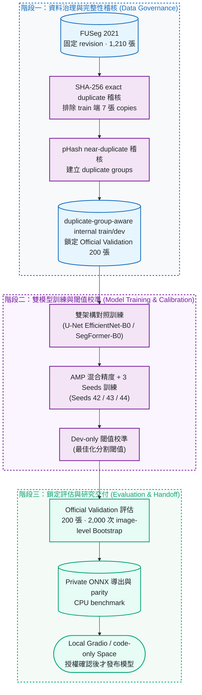

# WoundScope

[](https://colab.research.google.com/github/kuotunyu/WoundScope/blob/main/notebooks/WoundScope_FUSeg_FullRun_Colab.ipynb)
[](#快速開始)
[](https://github.com/kuotunyu/WoundScope/actions/workflows/ci.yml)
[](https://github.com/kuotunyu/WoundScope/releases/tag/v0.2.1)
[](LICENSE)

WoundScope 是以固定版本 FUSeg 建構的足部潰瘍 binary semantic segmentation **CV research flagship**：串接資料治理、可恢復 GPU 訓練、鎖定評估、ONNX parity 與 privacy-safe handoff。U-Net (EfficientNet-B0) 在 200 張 Official Validation 上的 observed Dice 為 **0.8508 ± 0.0035**（3 個 seeds；2,000 次 image-level Bootstrap 估計 95% CI）。

> **研究聲明**：本專案為研究用像素分割成果與工程管線展示，非臨床診斷建議；所有分析結果均需合格醫療專業人員複核。

---

## 系統設計與關鍵特性

1. **嚴謹資料治理與完整性稽核**：
   鎖定 FUSeg 2021 revision；以 SHA-256 exact duplicate 稽核排除 train 端 7 張 copies，以 pHash near-duplicate 稽核建立 duplicate groups，完整保留 200 張 Official Validation。
2. **可重現實驗與雙架構對照**：
   採 duplicate-group-aware internal train/dev、AMP、atomic resume、固定 seeds 42/43/44 與 Dev-only calibration。
3. **研究級部署驗證與安全交付**：
   完成 PyTorch→ONNX parity、CPU benchmark、local Gradio 與 privacy-safe aggregate handoff；weights／ONNX 維持 private，Hugging Face Space 為 code-only 候選。

---

## 系統架構與 Pipeline



---

## 成果展示與模型評測


<!-- RESULTS_TABLE_START -->

| Model | Loss | Seeds | Dice mean±SD (95% CI) | IoU | Precision | Recall | Specificity |
|---|---|---|---:|---:|---:|---:|---:|
| unet_efficientnet_b0 | bce_dice | 42/43/44 | 0.8508±0.0035 (0.8218–0.8768) | 0.7772±0.0039 | 0.8581±0.0056 | 0.9039±0.0032 | 0.9989±0.0000 |
| segformer_b0 | bce_dice | 42/43/44 | 0.8270±0.0040 (0.7973–0.8550) | 0.7437±0.0053 | 0.8326±0.0038 | 0.8832±0.0045 | 0.9988±0.0000 |

<!-- RESULTS_TABLE_END -->

- **數據來源**：結果來自 training commit `c7ec6060f1bd0a813a890b95b50c2855d3c2640c` 的 schema-valid、hash-bound handoff；每個 seed 均含完整 200 張評估證據。
- **統計解讀**：表格為 3 個 seeds 的 image-level mean 之 mean±sample SD；Dice 95% CI 由 2,000 次 image-level Bootstrap 估計。因缺少 patient ID，此 CI 無法校正同一病患多張影像的相關性。
- **架構表現**：U-Net 在此鎖定 split 的 observed Dice 較高；未做 paired significance 或外部驗證，不能推論跨機構或臨床優勢。

---

## 快速開始

Python 支援 3.11–3.12。以 [Public Colab](https://colab.research.google.com/github/kuotunyu/WoundScope/blob/main/notebooks/WoundScope_FUSeg_FullRun_Colab.ipynb) 為主要線上入口（按下 `Run all` 即可執行完整 GPU 訓練管線，產物保留於使用者個人 Google Drive）。

### 本機環境重現與資料下載

```powershell
# 1. 建立虛擬環境並安裝依賴
uv venv --python 3.12
uv sync --all-extras --frozen

# 2. 下載 FUSeg 數據集
$env:WOUNDSCOPE_DATA_DIR = "data"
.\.venv\Scripts\python.exe scripts\download_data.py
```

<details>
<summary><strong>啟動本機 Gradio Web UI</strong></summary>

```powershell
$env:WOUNDSCOPE_MODEL_PATH = "artifacts\runs\RUN\model.onnx"
$env:WOUNDSCOPE_CALIBRATION_PATH = "artifacts\runs\RUN\calibration.json"
.\.venv\Scripts\python.exe app\app.py
```

</details>

Hugging Face Space 目前為 `PERMISSION_PENDING`；維持 code-only 候選發布，部署與授權說明請見 [docs/huggingface-space-deployment.md](docs/huggingface-space-deployment.md)。

---

## 工程可信度與安全性

1. **資料層面**：固定 revision；SHA-256 負責 exact duplicate 排除，pHash 負責 near-duplicate 警示與 grouping。
2. **訓練層面**：duplicate-group-aware internal split、保守型增強、atomic checkpoint/resume 與固定 seeds。
3. **評估與部署**：僅用 internal Dev 凍結 Calibration，再評估隔離的 Official Validation；ONNX／weights 與模型 demo 不在公開 repository。
4. **品質門禁 (Quality Gates)**：Synthetic-fixture 測試、Ruff Format/Lint、Package Build 與資安隱私稽核持續防護。

---

## 限制與安全界線

- **患者 ID 限制**：資料集未包含 Patient ID，因此不宣稱 Patient-wise 絕對隔離，無法完全排除同病患跨視角之來源相關性。
- **外部有效性限制**：目前僅驗證單一公開資料來源；Official Test 無公開 Ground-truth Masks，亦無多中心、裝置或 subgroup validation。
- **指標限制**：影像以 longest-side resize／pad 至 512 評估；Specificity 易受大面積背景與 padding 主導，且目前未報告 HD95／ASSD。
- **授權限制**：FUSeg 與 pretrained weights 的公開再散布條款尚未完全釐清，因此不公開來源資料、weights、ONNX 或可推論的 live model。
- **非臨床診斷建議**：模型信心度代表分割演算法之數值穩定性與校準度，非臨床信心度；本專案僅供學術研究與工程探索。

---

## 文件與 Release

- [v0.2.1 Release](https://github.com/kuotunyu/WoundScope/releases/tag/v0.2.1)：CV research flagship 收尾、證據契約與公開文件精準化。
- [v0.1.0 Result Release](https://github.com/kuotunyu/WoundScope/releases/tag/v0.1.0)：正式實驗的 privacy-safe aggregate results 與 provenance。
- [DATA_CARD.md](DATA_CARD.md) / [MODEL_CARD.md](MODEL_CARD.md)：資料治理、實驗協議、模型指標與使用邊界。
- [CITATION.cff](CITATION.cff) / [Apache-2.0 LICENSE](LICENSE)：學術引用格式與程式碼授權。
