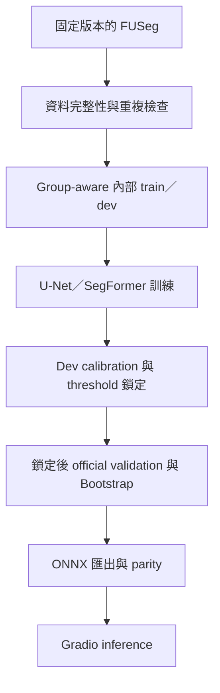

# WoundScope README 精簡設計

## 目標

將 README 重整為「作品集第一眼有力、工程證據可追查」的首頁。第一優先讀者是 GitHub／作品集瀏覽者；ML Engineer 所需的重現入口、結果來源與安全界線保留，但不再用長篇命令與逐項說明占據主要閱讀動線。

## 已確認方向

- 以正體中文（`zh-TW`）為主，FUSeg、U-Net、SegFormer、ONNX、Gradio、calibration、threshold、parity 等 technical proper nouns 保留原文。
- 內容以 30 秒可理解為準則：先定位、成果與可信度，再提供操作入口。
- 不更動模型結果、scientific protocol、資料治理決策、授權邊界或 medical disclaimer。
- 不增加 official-test、patient-wise、clinical diagnosis、severity、prognosis 或 treatment claims。
- 不公開 data、weights、ONNX binaries、private galleries 或 image-level artifacts。

## README 結構

1. **Hero**：一句話定位、必要 badges 與主要 Colab action。
2. **專案亮點**：以三個短句呈現 end-to-end pipeline、可重現性與 deployment readiness。
3. **已驗證成果**：保留 schema-valid aggregate visual 與精簡 marker table，明確標示 locked official-validation、`n=3 seeds`、非 official-test／非 clinical performance。
4. **Pipeline**：使用窄版直式 Mermaid，節點以正體中文為主。
5. **快速開始**：Colab 作為主要入口；本機只保留 frozen install 與必要 Gradio environment variables。其餘命令改用可展開區塊或既有文件連結。
6. **工程可信度**：濃縮資料完整性、duplicate mitigation、可恢復訓練、calibration、ONNX parity 與 test suite。
7. **限制與安全界線**：保留資料切分限制、正式 test 無 masks、研究用途與人工複核邊界。
8. **文件與 Release**：集中連到 DATA_CARD、MODEL_CARD、PROJECT_PLAN、v0.2.0 software release、v0.1.0 result release 與 Hugging Face Space deployment 狀態。

## Mermaid

採單一路徑直式流程，降低 GitHub 桌面版與手機版的橫向縮放：

## 精簡原則

- 刪除重複敘述、逐項 implementation inventory 與可由專案文件回答的背景。
- 結果表只留能快速比較的核心 aggregate metrics；完整 statistics 連到 release evidence。
- 多組 CLI commands、evaluation walkthrough 與 90 秒展示腳本退出主要閱讀動線。
- 保留 test contracts 依賴的 public Colab URL、frozen sync、PowerShell environment variables、result markers、release links、aggregate SVG 與 Hugging Face Space permission status。
- Hero 不堆疊大量 badges 或誇張形容詞；可信度由已驗證結果與工程 gates 支撐。

## 驗證

- README metadata／results marker／Hugging Face Space contracts 全部通過。
- Markdown local links、Mermaid syntax、UTF-8 與 `git diff --check` 通過。
- 完整 test suite、Ruff、format 與 tracked privacy audit 不退步。
- 最終人工檢查 GitHub 閱讀順序、窄螢幕 Mermaid 可讀性、技術專有名詞與正體中文一致性。

## 明確不做

- 不重跑 training、evaluation、ONNX export 或 GPU workload。
- 不修改 aggregate results、release assets、tags、history 或 remote metadata。
- 本次不 push；若完成後需要發布，等待使用者另行明確指示。
